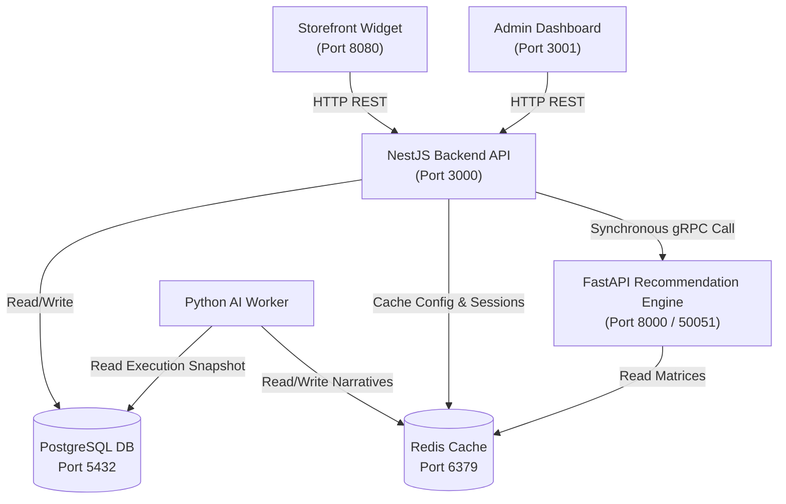

# Service Dependency Diagram

```mermaid
graph TD
    CLIENT_WIDGET["Storefront Widget<br/>(Port 8080)"]
    CLIENT_ADMIN["Admin Dashboard<br/>(Port 3001)"]

    API["NestJS Backend API<br/>(Port 3000)"]
    ENGINE["FastAPI Recommendation Engine<br/>(Port 8000 / 50051)"]
    WORKER["Python AI Worker"]

    POSTGRES[("PostgreSQL DB<br/>Port 5432")]
    REDIS[("Redis Cache<br/>Port 6379")]

    CLIENT_WIDGET -->|HTTP REST| API
    CLIENT_ADMIN -->|HTTP REST| API

    API -->|Read/Write| POSTGRES
    API -->|Cache Config & Sessions| REDIS
    API -->|Synchronous gRPC Call| ENGINE

    ENGINE -->|Read Matrices| REDIS
    WORKER -->|Read Execution Snapshot| POSTGRES
    WORKER -->|Read/Write Narratives| REDIS
```
